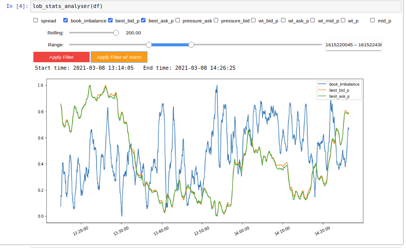

# BTGPactual Home Broker 3rd party api

This is a Python api to connect with BTGPactual Web Home Broker. This api enables users to develop their own tools to support theirs trading strategies.

## Configuration keys
Create config.json file, just like bellow:
```json
{
  "SYMBOLS": ["?????"],
  "ACCOUNT": "?????",
  "TKNWF": "?????",
  "ENDPOINT": "wss://webfeeder.btgpactual.com/ws?reconnect="
}
```
replace "?????" accordingly:
| KEY | VALUE |
|:---:|:------|
|SYMBOLS| Symbols to be monitored |
|ACCOUNT| Your BTG account number |
|TKNWF| Web Home Broker Token |
|ENDPOINT| Websocket URL |


## AggregatedBookType example
| BID # | BID QTY | BID $ | ASK $ | ASK QTY | ASK # |
|:-----:|:-------:|:-----:|:-----:|:-------:|:-----:|
|   1   |  100.0  | 98.45 |  98.5 |  200.0  |   2   |
|   1   |  3000.0 | 98.43 | 98.54 |  3500.0 |   1   |
|  ...  |   ...   |  ...  |  ...  |   ...   |  ...  |
|   3   |  300.0  | 98.25 |  98.7 |  900.0  |   4   |
|   1   |  100.0  | 98.24 | 98.75 |  400.0  |   4   |


## BusinessBookType example
|  QTY  | PRICE | BUY |          TIME          | SELL | AGRESSOR |
|:-----:|:-----:|:---:|:----------------------:|:----:|:--------:|
|  700  | 22.39 |  40 | Mar 7, 2021 6:11:23 PM |  3   |    I     |
|  1000 | 22.39 |  40 | Mar 7, 2021 6:11:23 PM | 1099 |    I     |
|  ...  |  ...  | ... |         ...            | ...  |   ...    |
|  3000 | 22.39 |  40 | Mar 7, 2021 6:11:23 PM | 386  |    I     |
|  1500 | 22.39 |  40 | Mar 7, 2021 6:11:23 PM | 1099 |    I     |


## AggregatedBookAnalytics

|       ANALYTIC       | RESULT |
|:--------------------:|:------:|
|   Bid/Ask Spread $   | 0.040  |
|      Book depth      |   15   |
|    Book Imbalance    | -0.016 |
|    Balance Ask %     | 0.508  |
|    Weighted Ask $    | 22.736 |
|      Best Ask $      | 22.42  |
|   Weighted Price $   | 22.474 |
| Weighted Mid Price $ | 22.400 |
|    Middle Price $    | 22.400 |
|      Best Bid $      | 22.38  |
|    Weighted Bid $    | 22.209 |
|    Balance Bid %     | 0.492  |


## Widgets for Limit Order Book statistics


## Troubleshooting
* update TKNWF token and restart connection
```json
{'message': 'Usuário não autorizado ou token inválido.', 'code': 111}
```


##  Reference

* [Manual](http://files.cedrofinances.com.br/Downloads/Manuais/Manual_Integracao_e_Funcionalidade_WebFeeder.pdf) - Manual de Integração e Funcionalidade
* [Paper](http://www.pbcsf.tsinghua.edu.cn/research/caoquanwei/paper/10.The%20Information%20Content%20of%20an%20Open%20Limit%20Order%20Book.pdf) - The information content of an open limit-order book
* [Thesis](https://tspace.library.utoronto.ca/bitstream/1807/70567/3/Rubisov_Anton_201511_MAS_thesis.pdf) - Statistical Arbitrage Using Limit Order Book Imbalance
* [Paper](http://www.columbia.edu/~ww2040/orderbook.pdf) - A stochastic model for order book dynamics
