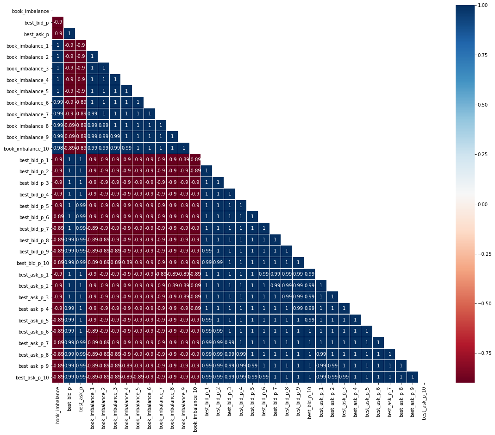

# Miscellaneous ideas
Here are some ideas for trading alerts.

## Negative correlation between: Order Imbalance and Price
### case 1
* symbol:vale3
* date:20210312
* epoch: 1615574725 – 1615576600
* stats: book_imbalance, mid_p

## Alerts (screening)
* check all ticker ...
** short: if price is going DOWN consistently with high trade volumes
** long: if price is going UP consistently with high trade volumes

consistently = multiple times within time range

The signals are then calculated based on these stats:
- whether it is a downtrend or uptrend
- whether the expected price given from the beta is overbought or oversold
This model takes a mean-reverting approach:
- On a BUY signal indicating oversold and uptrend, we take a LONG position.
  Then close the LONG position on a SELL signal.
- Conversely, on a SELL signal, we take a SHORT position and closeout on a BUY signal.
